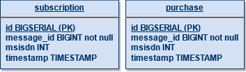

# Publisher-Subscriber
В этой ветке находится light-версия задания. Более сложную версию см. в ветке main.

Unit-тесты не сделаны для экономии времени (в реальной работе лучше использовать TDD, конечно).

Так как таблицы две, то можно было бы сделать два DAO-класса, но тут действия с таблицами идентичны, поэтому у меня только один DAO.

Схема БД:

